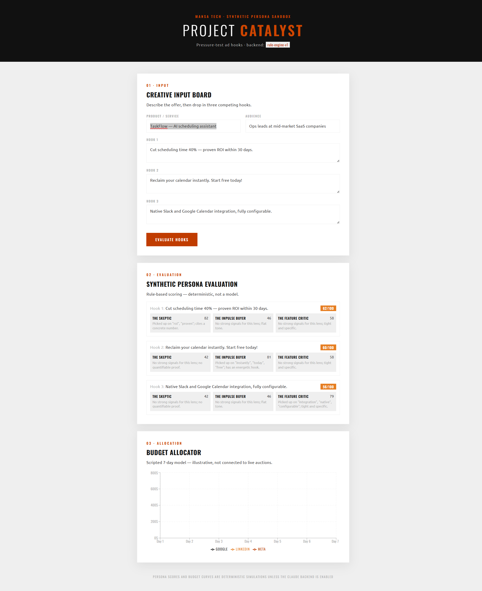

# Project Catalyst

> Pressure-test ad creative against a panel of synthetic buyer personas, then turn the winning hook into a ready-to-review ad — before spending a dollar.

[](https://github.com/mansaJones/project-catalyst/actions/workflows/ci.yml)

**Live demo → [project-catalyst.mansa-tech.com](https://project-catalyst.mansa-tech.com/)**

A self-contained React app for paid-media creative testing: describe an offer,
write up to three competing ad hooks, choose which of seven synthetic buyer
personas weigh in, and get an instant scored critique of every hook through each
persona's lens. Then take a winner into the Ad Studio and render it as a real ad
mockup — all before a dollar hits a live auction.

Scoring runs as a **deterministic rule engine by default** — same input, same
output, zero latency, free and reproducible. The scoring and ad-generation
backends are swappable, so the same UI can run on real Claude calls instead
(see [Running with Claude](#running-with-claude)).



## Features

- **Creative Input Board** — a product/audience brief and up to three competing ad hooks, plus one-click sample ads.
- **Seven buyer personas** — the Skeptic (CFO), Impulse Buyer (executive), Feature Critic (product), Bargain Hunter, Brand Loyalist, Researcher, and Trend Seeker. Pick which are in play; **every hook is scored by all active personas**.
- **Persona evaluation** — each hook scored 0–100 by each active persona with a one-line rationale, plus an average per hook.
- **Ad Studio** — turn a chosen hook into a ready-to-review mockup for **Google Search**, **Instagram/Meta**, and a **display banner**. Copy comes from a deterministic generator by default, or Claude-written copy / a Claude-generated **"AI design"** layout (rendered in a sandboxed frame) when the backend is enabled.
- **Sample ad presets** — three brand-styled concepts (B2B SaaS, DTC, fintech) with brief, personas, hooks, and a creative image.
- **Swappable engine** — rule engine by default; Claude-backed evaluator and ad generators behind the same interfaces.

## Run it

```bash
npm install
npm run dev      # http://localhost:5173
npm test         # 19 unit tests (Vitest)
npm run build    # typecheck (tsc) + production build
```

By default the app uses the deterministic rule engine — no server or API key needed.

## Running with Claude

To score hooks and generate ad copy/designs with Claude, run the frontend and the
local API server together:

```bash
cp .env.example .env       # add your Anthropic key
echo "VITE_USE_LLM=true" >> .env
npm run dev:all            # Vite + the API server (which holds the key)
```

The key lives only in the server process, never in the browser. The app header
should then read `backend: claude-evaluator`. To run this on the **live site**,
see [`SETUP.md`](SETUP.md) — a two-service Render blueprint with CORS and rate
limiting.

## Architecture

The scoring backend sits behind a one-method `PersonaEvaluator` interface, and the
ad features behind a small client, so the rule engine and the Claude versions are
interchangeable and the UI never changes. Switching to Claude is a single flag
(`VITE_USE_LLM`).

| Path | What |
|------|------|
| `src/types.ts` | Shared domain types (brief, hooks, results). |
| `src/personas/PersonaEvaluator.ts` | Evaluation **interface** — the swap seam. |
| `src/personas/ruleEngine.ts` | Deterministic 7-persona scorer (default). |
| `src/personas/llmEvaluator.ts` | Claude-backed scorer; posts to the API. |
| `src/personas/index.ts` | Selects the active backend (`VITE_USE_LLM`). |
| `src/samples.ts` | The three sample ad presets. |
| `src/adFormats.ts` | Ad format definitions + deterministic copy generator. |
| `src/ads/adClient.ts` | Claude ad-copy / ad-design clients. |
| `src/components/AdStudio.tsx` | The Ad Studio (formats, modes, sandboxed AI design). |
| `server/index.mjs` | Local Express API: `/api/evaluate`, `/api/ad-copy`, `/api/ad-design`. |
| `src/App.tsx` | State wiring. |

## Stack

- **Frontend:** React 19 · TypeScript · Vite · Tailwind CSS v4 · Google Fonts (Oswald / Ubuntu)
- **Backend (optional):** Node.js · Express · Anthropic SDK (Claude Haiku 4.5)
- **Quality:** Vitest · ESLint · GitHub Actions CI
- **Hosting:** Render (static site + Node API) on a custom domain

Styled to the Mansa Tech brand — burnt-orange on near-black ink, sharp corners.
